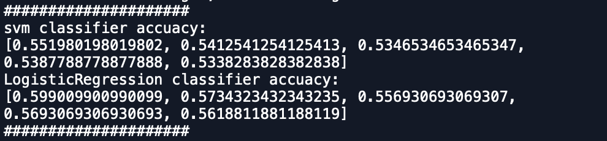
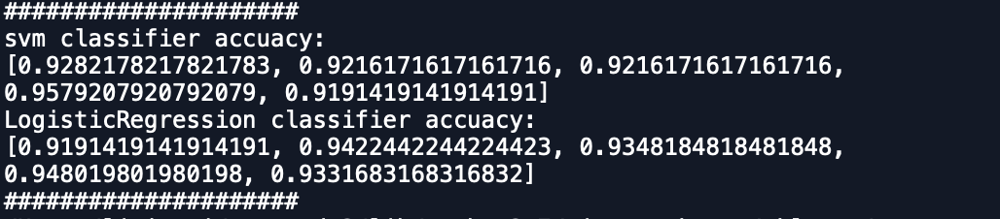
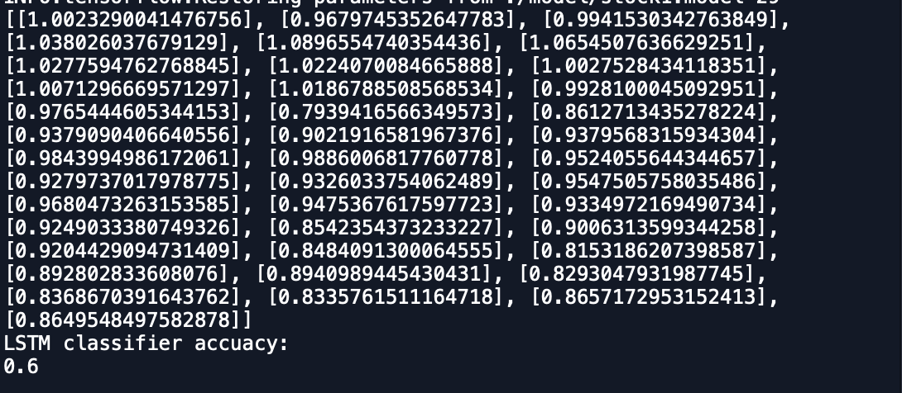

# lstm-svm-lr
三种模型对比

###1.环境和包
	python3 
	tensorflow
	sklearn
###2. 模型
	1.逻辑回归
	2. svm
	3. lstm
###3. 文件
	ls.py  --- svm and logistic regression model
	tf_lstm.py --- lstm model
	data.csv --- data
	readme.md --- document

###4. 结果
####1.svm and LG
- 只使用open, high,low, close, volume因子做特征的svm和logistic regression结果

可见，逻辑回归在测试集上的准确率平均高于svm

- 当加入amount，chg，chg-per特征后的svm和logistic regression结果

明显这三个因子作为特征很大程度上提高了预测的准确率，两个模型对比上不相上下

- 原因思考： LG模型更加关注整体的大局，而svm更加关注和分类最相关的点，当加入后三个特征时（该些特征对分类产生大的影响），因而大大提高svm的预测准确率

####2.lstm
- 以close为时间序列，预测结果如下：

1. 可见准确率在60%上下，相比只使用价格因子的lg和svm模型效果较好，但如何往lstm里进行多维时间序列预测有待改进

2. lstm相比前两个模型而言，它做的是数值上的预测，而lg和svm做的是有监督的分类模型。

- 时间原因未对lstm进行调参
- 本例中，lstm在预测长度为60左右有最好预测效果，同时，训练次数增加能有效提高预测准确率

####3.模型以外：
	因为我们的目标是对下一天行情的涨跌做预测，所以我认为我们更加应该关注近期的涨跌波动，
	因此在处理数据时我去除了数据里的trend，season项，保留了其循环波动项进行预测， 
	实践证明准确率比原始数据集提高许多
	
###4.总结
- 当我们有较少特征因子时，逻辑回归的预测效果优于svm，当我们有较多特征因子时，可以大幅度提高预测准确率，两者模型不相上下，但lg更适合处理大规模数据分类问题。
- 当我们更加关注预测值而不是涨跌分类时，lstm有较好的效果，且当作为分类器且特征因子较少时，lstm的效果优于前两个模型，如何使用lstm进行多特征分类有待思考
	
	

